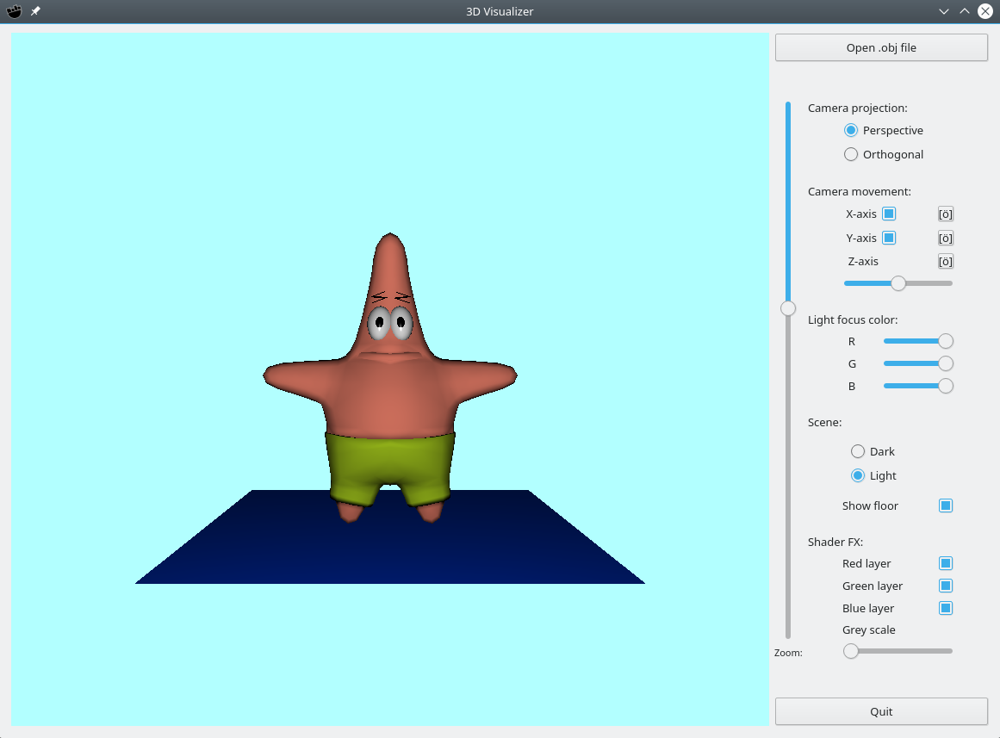
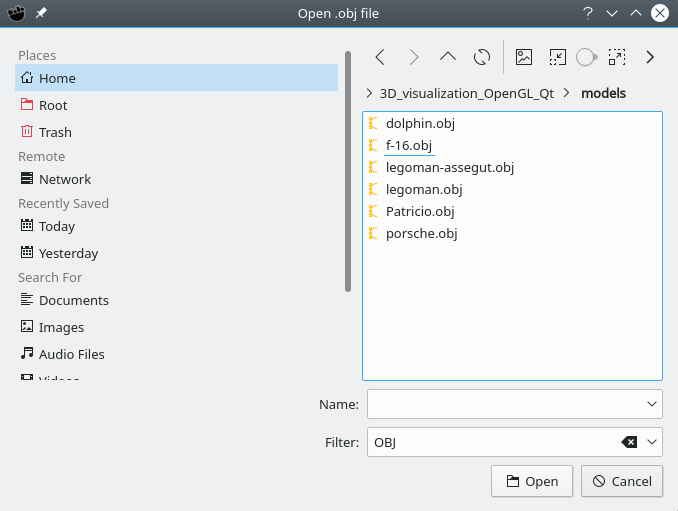
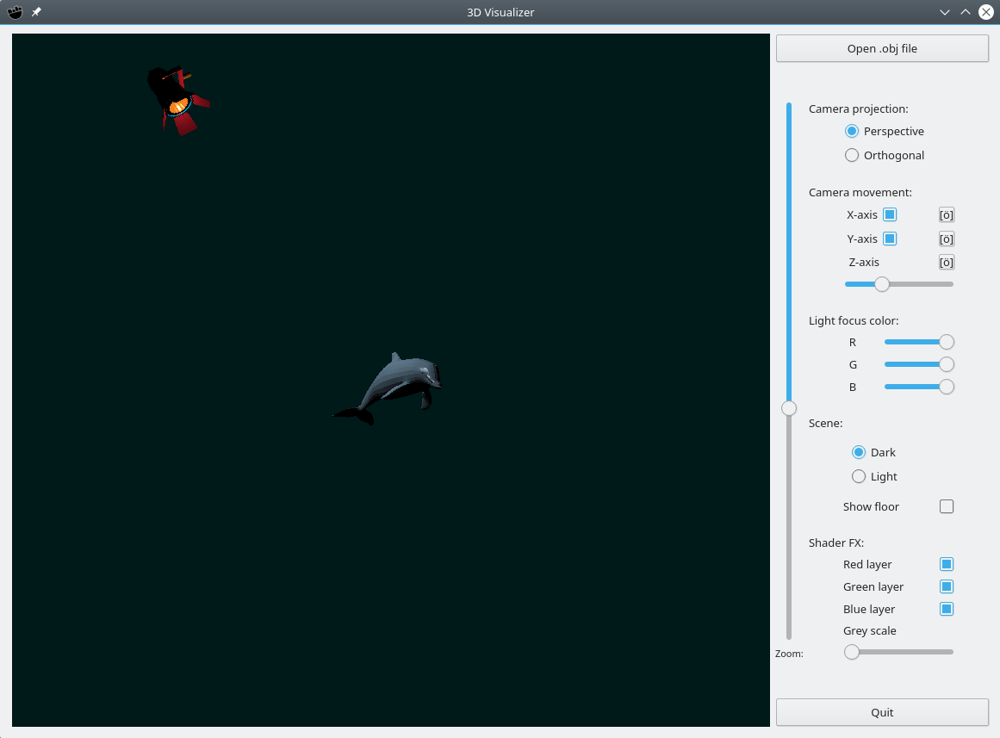
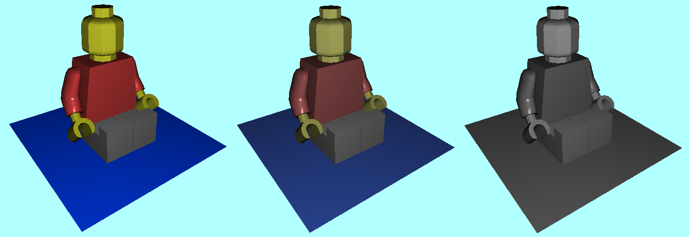
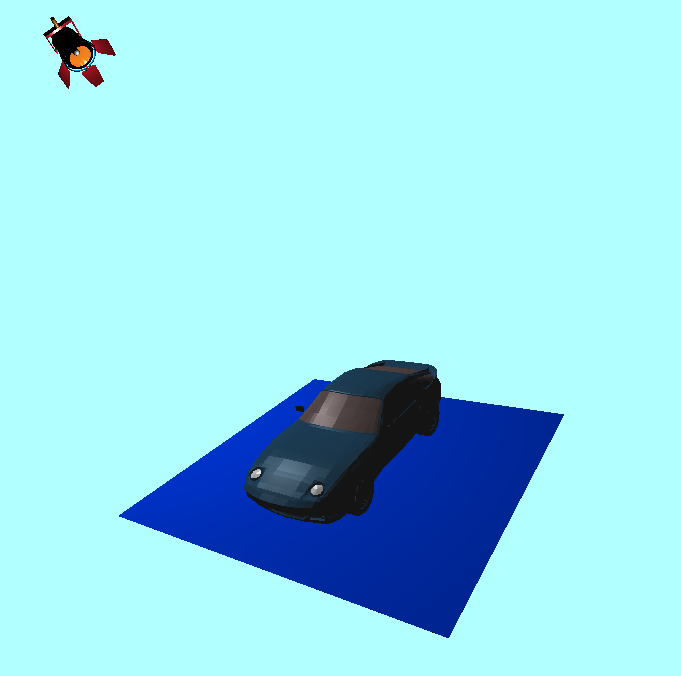

# 3D_visualization_OpenGL_Qt
With the knowledge provided by the IDI subject of FIB at UPC.

Usage:
  1. If you do not have qt, glm, or OpenGL installed you should do the following:
  
    If you are using the openSuse Linux distribution install these packages:
      libqt4-devel
      libQt5Core-devel
      libQt5Designer5                      //not sure if needed
      libQt5DesignerComponents5            //not sure if needed
      libQt5OpenGL-devel
      libQt5OpenGLExtentions-devel-static
      glm-devel

    If you are using a different Linux distribution or Windows there should be equivalent packages.
    
  2. Once everything is installed correctly follow the next steps to start the program:
  
    Open the command line in the 3D_visualiztion_OpenGL_Qt directory and type:
      cd Programa
      qmake-qt5
      make
      ./Visualitzador

If done correctly, a window should open:

If you want to see other 3D models or import your own click on the button "Open .obj file" and a window like the following will let you search the desired file:

UI elements:
  1. Camera projection: (Perspective/Orthogonal).
  2. Camera movement:

    2.1 X-axis can be enabled or disabled when rotating the scene, the button next to it with the "camera" symbol centers the camera to the X-axis.
    2.2 Y-axis can be enabled or disabled when rotating the scene, the button next to it with the "camera" symbol centers the camera to the Y-axis.
    2.3 As the Z-axis is not modified when rotating the scene you can do so with a slider, the button next to it with the "camera" symbol centers the camera to the Z-axis.
  3. Light focus color: Three sliders specify the R, G, B values of the color of the light source.
  4. Scene:
  
    4.1 You can select between a dark background and a lighter one.
    4.2 The floor surface can be rendered into the scene or not.

  
  5. Shader FX:
  
    5.1 Three check-boxes specify which layers of color should be ignored or painted after processing the image (to show the three components separately).
    5.2 The grey scale slider specifies the percentage of saturation and produces the following effect:
    

  6. Zoom: Slider that expands or shrinks the field of view to achieve a zoom-out / zoom-in effect.

The only features that are not shown in the UI and you can use are:
  1. Rotate the scene with mouse left-click and drag.
  2. Rotate the light source around the scene with mouse right-click and drag.
  
There are also some keyboard shortcuts to some features shown in the UI, here listed:

  'P' -> Swaps between the perspective and the orthogonal projection.
  
  'D' -> Sets the background color to a dark blue.
  
  'L' -> Sets the background color to a light blue.
  
  'X' -> Centers the camera position to the +X axis of the model.
  
  'Y' -> Centers the camera position to the +Y axis of the model.
  
  'Z' -> Centers the camera position to the +Z axis of the model.
  
  'R' -> Turns on or off the rendering of the red color component.
  
  'G' -> Turns on or off the rendering of the green color component.
  
  'B' -> Turns on or off the rendering of the blue color component.

Most recent update: Added a light focus 3D model to visualize the position of the light source in the scene:

